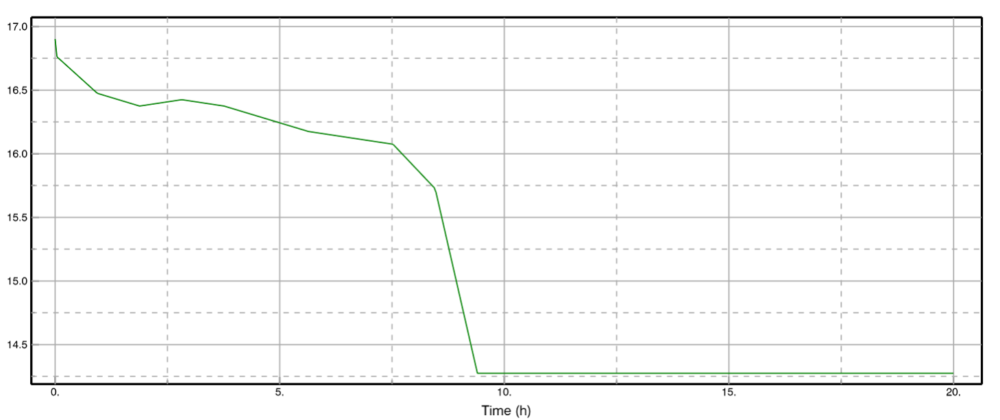

# Modelica Battery Library
A Modelica-based library that provides researchers and engineers with a platform to model and experiment with different battery chemistries.
The library is designed to make it easier to simulate custom battery models, validate new chemistries, and analyze performance within system-level simulations.

## Features
This library comes with two built-in chemistries, LFP (Lithium Iron Phosphate) and NMC (Nickel Manganese Cobalt Oxide). allowing users to quickly simulate well-known batteries. It is designed to be easily extensible, so researchers can implement their own chemistries by defining new OCV–SoC relationships and parameter sets, such as for LTO or NaB cells. Once connected into a system, the library provides direct outputs such as state of charge, terminal voltage, power, and current, enabling fast performance evaluation. Since it is developed in Modelica, the components can be seamlessly integrated with existing system models in environments like Dymola or OpenModelica, making it a flexible foundation for both academic research and practical applications.

## Getting Started
### Tutorial: Simulating and Configuring an Existing Battery

After loading the **Battery Library** into your Modelica environment, follow these steps to simulate an existing battery model and configure it for your application.  

**Step 1:** Double-click on the existing battery model of your choice to open it. In this example, we will use **LFPBattery**.  

**Step 2:** Locate the battery component and open its **Edit Parameters** dialog box.  

**Step 3:** Since this is a pre-configured battery model, all chemistry-related parameters are already defined based on the physics of the chosen cell. You only need to adjust the **Ns** (number of series cells) and **Np** (number of parallel cells) according to your desired configuration. 

**Step 4:** Proceed to the testing environment. Drag and drop the customized **LFPBattery** into the workspace. Apply a constant current input (for example, 20 A to represent a continuous 20-ampere discharge from the battery).  

Run the simulation to observe the outputs

### Simulation Results
#### State of Charge (SOC)

The state of charge curve shows that under a constant discharge of 20 A, the configured battery is fully depleted after approximately 9.4 hours. This highlights the effective capacity of the chosen configuration.

#### Voltage

The voltage curve indicates that the battery begins at a maximum voltage of around 16.9 V at 100% SOC. As the state of charge decreases, the voltage gradually drops, which is clearly visible in the graph. This trend follows the expected OCV–SoC relationship for the selected chemistry.

#### Power

The power graph illustrates the instantaneous output power of the battery throughout the discharge cycle. At the beginning, the power is higher due to the combination of high voltage and constant current. As the SOC decreases and the voltage drops, the available power also decreases proportionally. This graph is particularly useful for understanding how the battery delivers energy over time and for evaluating performance under different load conditions.
